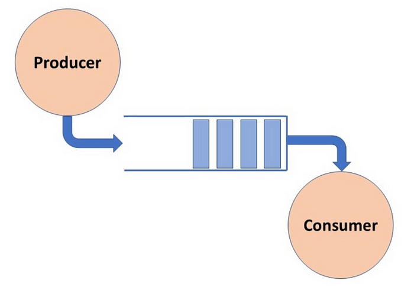

# Ejemplo 2: Productor consumidor

En el siguiente programa es el clasico problema productor consumidor aplicado a la conurrencia y el cual sigue el siguiente esquema:

El objetivo de esta arquitectura es que el productor y el consumidor trabajen de manera independiente, es decir, el productor no debe esperar a que el consumidor consuma un elemento para seguir produciendo y viceversa. Para lograr esto se utiliza un buffer que es compartido por el productor y el consumidor. El productor pone elementos en el buffer y el consumidor los consume. El buffer tiene un tamaño limitado, por lo que el productor debe esperar a que el consumidor consuma un elemento para poder seguir produciendo y viceversa, no se puede consumir si esta vacio y no se puede producir se esta lleno.

> [!NOTE]
> Esta es una verison simplificada donde el buffer solo continene un elemento.

La sincronizacion para el correcto funcionamiento de la concurrencia estan implementados en los metodos put y get de la clase Buffer.
